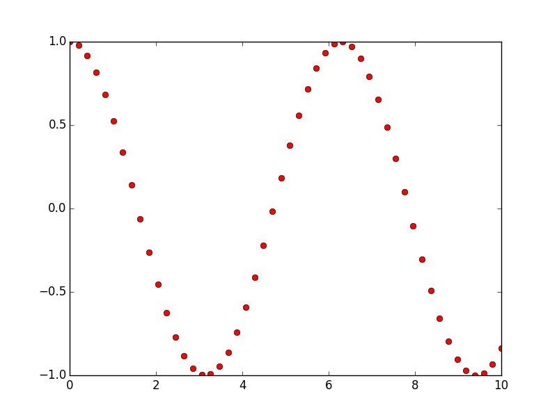

# Gráficas con Matplotlib

## Aquí comenzamos...

Matplotlib es una librería de Python para el trazo de gráficas, desarrollada inicialmente por 
John Hunter. Tiene una sintaxis inspirada en MATLAB y comparte mucha similitud en las principales 
funciones, aunque Matplotlib permite un desarrollo de gráficas utilizando el enfoque orientado 
a objetos, lo cual le convierte en una herramienta muy potente.


## Una primera aproximación: utilizando pylab

Este primer capítulo tiene como objetivo mostrar algunas de las capacidades de Matplotlib de manera 
breve y un tanto *superficial*, utilizando la interfaz de pylab, esto para familiarizar al lector 
con la sintaxis y el uso de algunas funciones elementales.

El módulo `pylab` integra las capacidades gráficas de Matplotlib con algunas utilidades de NumPy, 
proporcionando de esta manera una interfaz muy parecida a MATLAB para el manejo de gráficas.

En este capítulo vamos a suponer que, antes de todo, se ha importado pylab de la siguiente manera:

```python
from pylab import *
```

Lo anterior nos permitirá disponer de todas las funciones de pylab dentro de  nuestro script.

Luego, graficar nuestro primer ejemplo será tan sencillo como escribir.

```python
plot([1,-2,5,-2,1,0,3])
show()
```


La función `plot`, en el caso anterior, recibe como argumento un arreglo de valores numéricos, que 
puede ser un lista de Python ordinaria, una tupla, y de manera más común un array de NumPy. La función 
`show` permite mostrar en pantalla la linea o gráfica que se ha creado con `plot`.

Ahora, como se ha mencionado, `pylab` también permite utilizar funciones de NumPy para la definición 
de arrays. Por ejemplo, con `linspace` podemos crear un vector de valores numéricos:

```python
linspace(a,b,n)
```

Siendo **a** el extremo inferior, **b** el extremo superior, y **n** el número de particiones en el intervalo 
{$$}[a,b]{/$$}. Por ejemplo:

```python
>>> linspace(1,10,10)
array([  1.,   2.,   3.,   4.,   5.,   6.,   7.,   8.,   9.,  10.])
```

Luego, a estos arrays de NumPy podemos aplicarles funciones matemáticas predefinidas, por ejemplo:

```python
>>> x = linspace(0,2*pi,10)
>>> y = cos(x)
>>> x
array([ 0.        ,  0.6981317 ,  1.3962634 ,  2.0943951 ,  2.7925268 ,
        3.4906585 ,  4.1887902 ,  4.88692191,  5.58505361,  6.28318531])
>>> y
array([ 1.        ,  0.76604444,  0.17364818, -0.5       , -0.93969262,
       -0.93969262, -0.5       ,  0.17364818,  0.76604444,  1.        ])
```

Con lo anterior crearemos nuestra primer gráfica de una función matemática:

```python
x = linspace(0,10)
y = cos(x)
plot(x,y)
show()
```


Note que a `linspace` no le hemos indicado el número de particiones del intervalo, con lo cual 
se toma por default un valor de 50.

Podemos cambiar el color y estilo de línea pasando una cadena de dos caracteres como tercer argumento, 
donde el primer caracter indica el color y el segundo el símbolo a utilizar, 
por ejemplo:

```python
x = linspace(0,10)
y = cos(x)
plot(x,y,"ro")
show()
```



Puede consultar los caracteres válidos para el color y estilo de línea en la documentación 
de la función [plot](http://matplotlib.org/api/pyplot_api.html#matplotlib.pyplot.plot).

Es posible también especificar el color y estilo utilizando [keyword arguments](https://docs.python.org/2/tutorial/controlflow.html#keyword-arguments) dentro de la función plot:

```python
plot(x,y,linestyle="--",color="k")
```

Además, el color también puede especificarse utilizando la notación RGBA y la notación hexadecimal, 
por ejemplo, las siguientes instrucciones son equivalentes:

```python
plot(x,y,color="r")
plot(x,y,color="#FF0000")
plot(x,y,color=(1,0,0,1))
```

Podemos incluir etiquetas en los ejes utilizando las funciones `xlabel` y `ylabel`. 
Por ejemplo:

```python
K = 525
n = 0.2
e = linspace(0,0.5)
s = K*e**n;
plot(e,s,'m')
xlabel(u"Deformación (mm/mm)")
ylabel(u"Esfuerzo (MPa)")
show()
```


Incluso se puede utilizar código TeX en las etiquetas y título de la gráfica:

```python
K = 525
n = 0.2
e = linspace(0,0.5)
s = K*e**n;
plot(e,s,'m')
xlabel(r"$\varepsilon$ (mm/mm)")
ylabel(r"$\sigma$ (MPa)")
title(r"Acero SAE 1008: $\sigma = K \varepsilon^n$")
show()
```


Para poder graficar en dos o más axes se puede utilizar la función `subplot` que permite 
crear un arreglo de axes, véase el ejemplo a continuación:

    t = linspace(0,2)
    x = 12*t**3 - 18*t**2 + 2*t + 5
    v = diff(x)
    # Gráfica de posición
    subplot(2,1,1)
    plot(t,x,"b")
    ylabel(u"Posición (m)")
    # Gráfica de velocidad
    subplot(2,1,2)
    plot(t[:-1],v,"g")
    xlabel("Tiempo (s)")
    ylabel(u"Velocidad (m/s)")
    show()


La función `subplot` recibe tres argumentos, los dos primeros especifican el número de filas y columnas 
del arreglo de axes, respectivamente, y el tercer argumento indica la posición del axes a utilizar.
La función [diff](http://docs.scipy.org/doc/numpy-1.10.0/reference/generated/numpy.diff.html) calcula 
la n-ésima derivada numérica de un vector dado.


## Pyplot y lo básico

En el Capítulo 2 vimos una introducción a `pylab`, un módulo de matplotlib que integra 
las utilidades gráficas del módulo `pyplot` y de la librería NumPy en un mismo *espacio de nombres*. 
El uso de `pylab` hace recordar mucho la sintaxis y la *filosofía de programación* de MATLAB. 
Por ello (y por razones que iremos conociendo posteriormente) en el entorno de Matplotlib es 
preferible utilizar `pyplot` y `NumPy` cómo módulos independientes, permitiendo una 
estructuración más limpia de código, diferenciando la parte de proceso de datos y la 
de graficación/visualización.

Un código típico utilizando pylab sería:

```python
from pylab import *

x = linspace(0,10)
y = cos(x)

plot(x,y,lw=2,ls="--")
xlabel("Tiempo (s)")
ylabel("Amplitud (mm)")
show()
```

¿Y utilizando pyplot + NumPy?

```python
import matplotlib.pyplot as plt
import numpy as np

x = np.linspace(0,10)
y = np.cos(x)

plt.plot(x,y,lw=2,ls="--")
plt.xlabel("Tiempo (s)")
plt.ylabel("Amplitud (mm)")
plt.show()
```

Ambos códigos producen exactamente lo mismo. 

Ahora veremos una tercera forma (*mejorada*) de hacer lo anterior:

```python   
import matplotlib.pyplot as plt
import numpy as np

x = np.linspace(0,10)
y = np.cos(x)

fig = plt.figure()
ax = fig.add_subplot(111)

ax.plot(x,y,lw=2,ls="--")
ax.set_xlabel("Tiempo (s)")
ax.set_ylabel("Amplitud (mm)")

plt.show()
```

Y sí, en este texto vamos a utilizar esta *manera* de hacer las cosas, ¿la diferencia?: 
objetos, métodos y esas cosas propias de la programación orientada a objetos, que nos 
permitirá *organizar* nuestro código de una mejor manera, sobre todo cuando este 
tiende a ser extenso. De manera breve, lo que se hace es instanciar un objeto de 
la clase `Figure`, que es básicamente el objeto gráfico principal o lo que denominaríamos como 
*ventana*, y posteriormente se utilizan métodos de clase para crear un `Axes` y utilizar 
sus métodos para trazar la gráfica correspondiente y las etiquetas o leyendas necesarias.

Para las secciones siguientes se asumirá que en todo momento se han importado el módulo 
`pyplot` y `NumPy` y que al final del código se ha incluido la instrucción 
`plt.show()` para mostrar lo que se ha graficado.

```python
import matplotlib.pyplot as plt
import numpy as np
# .
# .
# .
plt.show()
```

### Coordenadas rectangulares

Hemos estado utilizando este tipo de gráficas en todos los ejemplos anteriores, entendemos 
por coordenadas rectangulares aquellas en donde cada punto del plano o espacio está dado 
por sus coordenadas (x,y) o (x,y,z) y las cuales hemos tenido *hasta en la sopa* desde nuestro 
primer curso de álgebra en el nivel secundario. Por ahora vamos a tomar el caso bidimensional, 
y en la mayoría de situaciones vamos a graficar un array que contiene los valores de la variable 
independiente (digamos *x*) contra un array que contiene los valores de la variable dependiente 
(digamos *f(x)*), utilizando, claro está, la función `plot`.

Por ejemplo supongamos que queremos graficar la función {$$}f(x)=x^2 sin(x){/$$} en el intervalo 
{$$}[0,2\pi]{/$$}. Primero debemos crear el vector o array de la variable independiente en 
el intervalo de interés, para ello podemos utilizar `linspace`:

```python
x = np.linspace(0,2*np.pi)
```

Enseguida definimos el array de la función o variable dependiente:

```python
y = (x**2)*(np.sin(x))
```

Ahora creamos el objeto `figure`:

```python
fig = plt.figure()
```

Utilizando el método `add_subplot` del objeto `fig` creamos el axes a utilizar:

```python
ax = fig.add_subplot(111)
```

Con nuestro axes creado, podemos utilizar el método `plot` para trazar la gráfica correspondiente:

```python
ax.plot(x, y)
```

Finalmente debemos utilizar la instrucción `plt.show()` para mostrar las gráficas que hemos generado. Juntando 
todo el código anterior se tiene:

```python
x = np.linspace(0,10)
y = np.cos(x)

fig = plt.figure()
ax = fig.add_subplot(111)

ax.plot(x, y)
```


### Etiquetas básicas (xlabel, ylabel & title)

Naturalmente una gráfica sin información extra más que las líneas trazadas es inútil desde donde se vea, porque cuando 
vamos a graficar algo el objetivo es transmitir información legible y en cierto punto amigable a terceros. Para ello 
en una gráfica se debe incluir información acerca de los datos que estamos representando.

En casi cualquier gráfica que veamos en libros, artículos o cualquier otro tipo de publicación vamos a tener al 
menos etiquetados los ejes coordenados, y una título o pequeña descripción que muestre lo que se representa. 
Para colocar esa información básica en una gráfica, Matplotlib proporciona los métodos `set_xlabel`, `set_ylabel` y 
`set_title` de la clase `Axes`, que de manera respectiva, colocan una etiqueta en el eje horizontal, una etiqueta en el 
eje vertical y un título en la parte superior del `Axes`.

En el siguiente código se muestra cómo colocar las etiquetas mencionadas anteriormente:

```python
T = [50, 60, 70, 80, 90, 100, 110, 120]
P = [12, 20, 33, 54, 90, 148, 244, 403]

fig = plt.figure()
ax = fig.add_subplot(111)

ax.plot(T, P)
ax.set_xlabel(u"Temperatura (°C)")
ax.set_ylabel(u"Presión (KPa)")
ax.set_title(u"Relación P-T")
```


### Estilos, colores y grosores de líneas


### Coordenadas polares

Para trazar gráficas en coordenadas polares en Matplotlib se utiliza también el método `plot`, pero cuando se 
crea el axes debemos cambiar el tipo de proyección que utilizaremos a coordenadas polares, lo cual puede hacerse 
de las utilizando el *keyword argument* `projection`:

```python
fig = plt.figure()
polar_axes = fig.add_subplot(111, projection="polar")
```

O bien utilizando `polar`:

```python
fig = plt.figure()
polar_axes = fig.add_subplot(111, polar=True)
```

Por ejemplo, trazando la rosa polar {$$}r(\theta) = 0.25\,\cos(3\theta){/$$}:

```python
theta = np.linspace(0,2*np.pi,1000)
r = 0.25*np.cos(3*theta)

fig = plt.figure()
ax = fig.add_subplot(111, polar=True)

ax.plot(theta, r)
```


### Scatter Plots


### Gráficas de barras


### Gráficas de pastel


